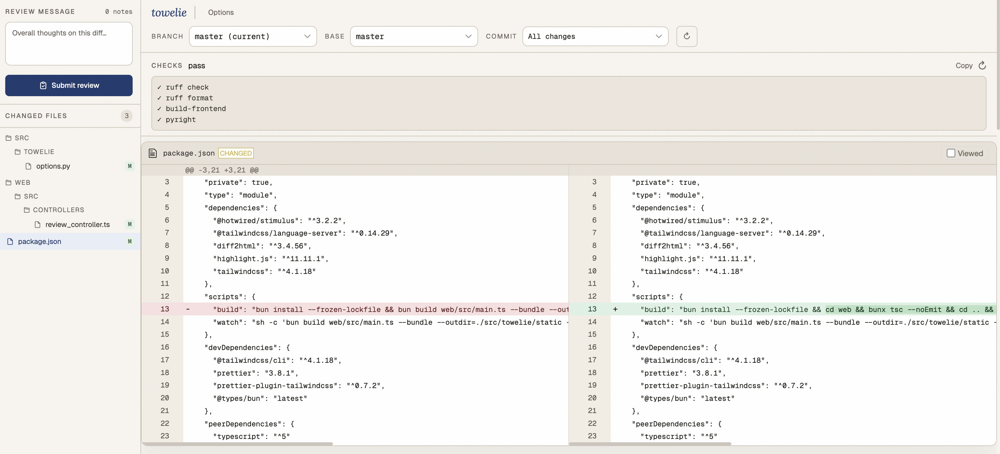
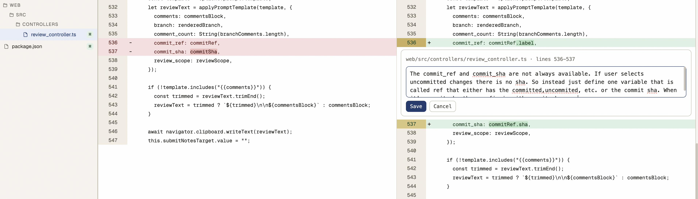

Last month I created a new project. It's called [Towelie](https://github.com/Glyphack/towelie).
Towelie is a tool for reviewing code locally, similar to the GitHub pull request review tool.

But why?
Like most people, I also don't like the AI slop produced by AI agents.
But I found that with some guidance, I can get what I want for certain tasks.
I have a loop that looks like this when I'm writing code with an agent:
- agent writes code
- I review using Towelie
- I give comments to the agent

My most effective AI usage is when I give a task that it can handle.
Give the agent a good way to verify its work and wait until it finishes the code.
Then instead of trying the feature I read the code. I can find stupid mistakes easier that way.
I also stay informed about the code this way.

## Workflow

As I said, I start by giving AI some task that I think it can do by itself.
Then I can return to my own work and leave it to work until it's finished.

Once it has the complete code I run `towelie`:



Here I can select the changes I want to look for (branch, commit, or even not committed changes) and review them.

If I find something that I don't like I leave a comment:



Then I can click finish review and have this copied to my clipboard:

~~~
Here's the review of the user. Go over the comments and resolve them. You can use git commands to get more context about some line changes if you need more information to implement the comment.

Overall notes:
This is almost good. I want to make sure the CommitRef datastructure is used through the review controller and we don't have logic and code duplication.

---

web/src/controllers/review_controller.ts lines 536-537 on the new code (after the change)

```
      commit_ref: commitRef,
      commit_sha: commitSha,
```

```
The commit_ref and commit_sha are not always available. If user selects uncommitted changes there is no sha. So instead just define one variable that is called ref that either has the committed,uncommited, etc. or the commit sha. When it's commit sha then prefix is with commit sha: ...
```
~~~

I copy this to my AI agent, and repeat the review until I'm happy.

## How does it work?

Towelie starts a server that serves the diff review tool.
It currently uses [`diff2html`](https://www.npmjs.com/package/diff2html) library for rendering the diff.
There are custom adjustments to `diff2html` to allow selecting lines and commenting on them.
For this I'm using [Stimulus](https://stimulus.hotwired.dev/).
This was my first experience using Stimulus, and I like it.
It's small and easy to work with. You can learn it in under an hour.

---

## Other Things 

I found [Tristan Hume's Hammerspoon config](https://github.com/trishume/dotfiles/blob/master/hammerspoon/hammerspoon.symlink/init.lua).
I borrowed some nice improvements for my own dotfiles.
My window manager now knows the last focused window and I can switch to it.
Did you know that he created [this module](https://www.hammerspoon.org/docs/hs.noises.html) that makes your mac respond to sounds?


[This channel](https://www.youtube.com/watch?v=b2F-DItXtZs) is so funny.
And so relevant.


I recently learned about [c reduce](https://bernsteinbear.com/blog/creduce/).
I wish I had it when I was debugging crashes in [ty](../ty-self.md). I will definitely use it next time I am debugging crashes.


I am starting to make more scripts in my projects.
It's more convenient, and `make` is not convenient for random scripting.
After reading [make.ts](https://matklad.github.io/2026/01/27/make-ts.html) I'm thinking about making the same setup with `uv`.
Right now I'm also using Typescript, but I'm more comfortable with Python.


I finally learned why git has conflicts when I am working on branch A from master, and branch B from A, then when A is merged to master and I rebase B, I get conflicts.
The solution is [this](https://stackoverflow.com/questions/71019922/git-rebase-a-branch-on-another-after-parent-branch-is-merged-to-master
).
```
git rebase --onto master branch-a(commit hash or the merge commit)
```


I used AI to improve the design for Towelie frontend.
I gave the same prompt to ChatGPT, Claude, and V0.
The result was that Claude built a much better-looking UI in the first shot and I decided to iterate on that.
What V0 and ChatGPT made was pretty similar, but it looked really basic and I didn't continue with prompting.
<details>
    <summary>Prompt</summary>
Hello, I want you to make a design for a web application. This web application is a local terminal application, but when you open it, when you run it, it will open a web page for you that you can interact with the application. What this does is that it's an offline code review tool where you can launch it and you will see the diff of the repository, git repository that you are at. You can select different branches, you can select the base branch, the other branch you want to check the diff and then you can select commits. You will see the file tree of the changes and you will see the files and you would see the lines and you can comment on the lines. And when it's done, there is a button for a finish review where you click and then you get your review copied to the clipboard. It's useful to use it with coding tools, AI coding agents. So you can review their code and give them back feedback in bulk. Make a design for it. I'm mostly looking for something minimal but also beautiful. Not too much clutter but it also should look nice. Like the color, typography, these kind of things. What are the important parts here?
Start with checking the requirements and ask me if there are any questions about it.
Don't want the full app just html and style with tailwind. Run it for me so I can see it.
Generate as a single HTML file tailwind. No js for functionality.
</details>


I made a [new raycast command](https://github.com/Glyphack/dotfiles/blob/2b56c48ea21fde3a65dbfdf98374882103c20e2a/raycast/commands/md-link.sh#L1) that pastes the current URL in my clipboard as a markdown link.
It automatically fetches the title. Titles are so long and full of fluff these days.


I usually use [Harper](https://writewithharper.com/) when I'm writing to catch grammar and spelling mistakes.
Sometimes it's too noisy with the false positives about my writing. So I also tried using more LLMs to check my writing and teach me my mistakes.
I still think Harper is a good tool (and similar tools), but I feel with LLMs it's nicer that you get a review with the context of what I'm writing.

Over the last couple of weeks I found myself having more projects open at the same time.
I usually have a couple of tabs open in my terminal.
So when having multiple projects it becomes a lot of tabs and hard to jump between them.
I asked Claude to make a workspace switcher for me, but it was not successful initially.
I found [smart_workspace_switcher.wezterm](https://github.com/MLFlexer/smart_workspace_switcher.wezterm/) and browsed some wezterm docs and guided it myself.
Finally it was able to make a [good session manager](https://github.com/Glyphack/dotfiles/blob/2b56c48ea21fde3a65dbfdf98374882103c20e2a/wezterm/wezterm.lua#L228).
Whenever I hit CMD + Enter I can switch between workspaces, create a new one, or delete one. It has fuzzy searching too.

I started making more functions for my fish shell. Just to make hard things easier.
For example, I used to have this problem where I generated some output in the terminal and needed to send it in Slack.
The problem was that I had to go to Slack and navigate to the correct folder.
Instead I made [this script](https://github.com/Glyphack/dotfiles/blob/master/fish/functions/%2Ccp.fish) that copies the file to my clipboard so I run the command and just go to Slack to paste.

I also finally decided to make my own git wrapper `,g`. 
It's for frequent stuff that I do:
- Update main and create a new branch from it
- List branches that I committed to and select one to switch
And more stuff that you can check [here](https://github.com/Glyphack/dotfiles/blob/master/fish/functions/%2Cg.fish)
