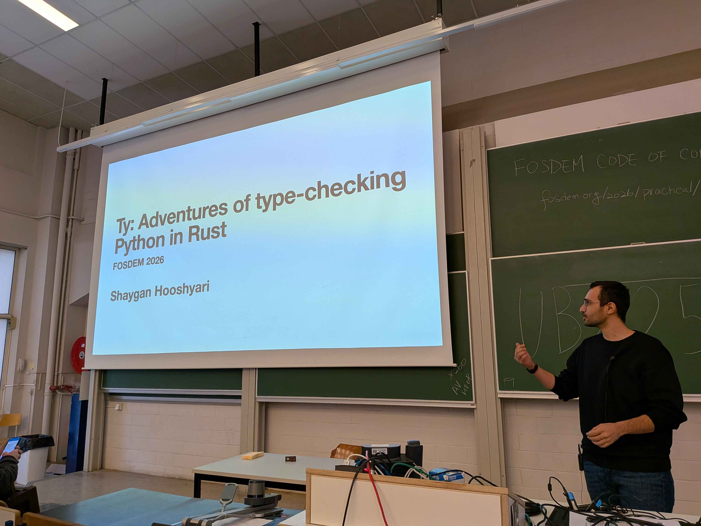
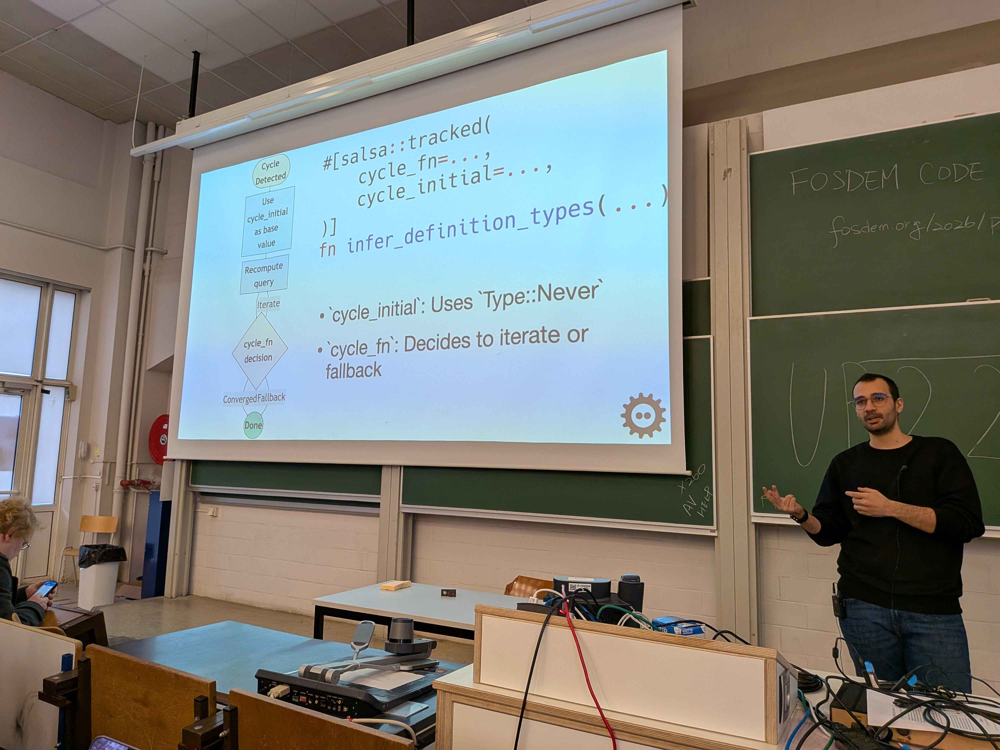

ty is one of the great examples of a challenging project that is simple to contribute to.
During last year I contributed to it and I learned a lot.
About type checking, structuring a complex project and taming complexity.







## Slides

[ty: Adventures of type-checking Python in Rust](/ty-f26.pdf)

## Links

- [ty codebase](https://github.com/astral-sh/ruff) ty code lives in the Ruff repository
- [ty repo](https://github.com/astral-sh/ty)
- [ty Playground](https://play.ty.dev)
