I like nature.
It's absolutely the best place to be, especially when traveling.
And I miss camping in the in the wild as is not allowed in the Netherlands.
Fortunately I'm living close to Sweden, and there they you sleep outdoors.
So this summer Yasaman and I tried kayaking & camping  in the southern archipelago of Sweden.

We planned to stay for two days, and needed a kayak and camping equipments.
Looking up online, I found few places in different cities that provided it.
I liked [Dalarö Kajak](https://www.google.com/maps/place/Dalar%C3%B6+Kajak/@59.1353285,18.4003147,15z/data=!4m15!1m8!3m7!1s0x465f7d2156bc730f:0xdf8ade05d0e72528!2s137+70+Dalar%C3%B6,+Sweden!3b1!8m2!3d59.1353294!4d18.4106144!16zL20vMDNfMGww!3m5!1s0x465f81fc6ca2e4cd:0x552c54a9a2e883e7!8m2!3d59.136158!4d18.4035397!16s%2Fg%2F1tr7bfby?entry=ttu&g_ep=EgoyMDI2MDgyNS4wIKXMDSoASAFQAw%3D%3D), for two reasons.
[Dalarö](https://www.google.com/maps/place/137+70+Dalar%C3%B6,+Sweden/@59.1353285,18.4003147,15z/data=!3m1!4b1!4m6!3m5!1s0x465f7d2156bc730f:0xdf8ade05d0e72528!8m2!3d59.1353294!4d18.4106144!16zL20vMDNfMGww?entry=ttu&g_ep=EgoyMDI2MDgyNS4wIKXMDSoASAFQAw%3D%3D) is a town in the south of Stockholm on the coast and closer to the open sea.
The other area were surrounded by land. It's more exciting to look around and just see water!
And the city was close to [Tyresta National Park](https://www.google.com/maps/place/Tyresta+National+Park+and+Nature+Reserve/@59.1298296,17.6869002,9z/data=!4m10!1m3!11m2!2sjPZifx44A-bs5CXxu5Ku0wQiJparFg!3e3!3m5!1s0x465f7dfb0b2221f5:0xc6be6d73b12ccc43!8m2!3d59.1843103!4d18.2811826!16zL20vMDlreDgw?entry=ttu&g_ep=EgoyMDI2MDkyMi4wIKXMDSoASAFQAw%3D%3D).
This means that after the being on the sea we could get back and hike in this giant forest.

---

We flew to Arlanda airport in Stockholm.
From there we wanted to use public transport to get to [Dalarö](https://www.google.com/maps/place/137+70+Dalar%C3%B6,+Sweden/@59.1353285,18.4003147,15z/data=!3m1!4b1!4m6!3m5!1s0x465f7d2156bc730f:0xdf8ade05d0e72528!8m2!3d59.1353294!4d18.4106144!16zL20vMDNfMGww?entry=ttu&g_ep=EgoyMDI2MDgyNS4wIKXMDSoASAFQAw%3D%3D), and pickup the kayak the next day and start our journey.
Our flight was delayed for 3 hours and we arrived around 11pm, we had to go to Haninge first and then take the bus.
But there was no bus departures at that time.
I checked Uber, it costed me 400 SEK but no driver was found for a long time.
In the meantime I asked a taxi driver near the central station, he told me 1200 SEK.
So I decided to patiently wait for Uber to find a driver.

We finally got to the room around 1AM.
Right after turning on the lights I saw a big spider on the ceiling. It was about the size of my thumb.
I liked spiders when I was a kid and always took some home with me whenever we went for hiking.
And while I was thinking whether I should act like when I was a kid or not I felt something walking on my foot. It was another spider!
That left us no choice but to help the spiders find their way outside of the window.
This took a while maybe 30 minutes or so. And we were tired.
Then I lay down and see another spider on the other side of the bed at the edge of the wall.
At that point I was too tired and decided that if I don't move much it's just going to chill at the edge of the wall there.

---

In the morning we walked toward [Dalarö Kajak](https://www.google.com/maps/place/Dalar%C3%B6+Kajak/@59.1353285,18.4003147,15z/data=!4m15!1m8!3m7!1s0x465f7d2156bc730f:0xdf8ade05d0e72528!2s137+70+Dalar%C3%B6,+Sweden!3b1!8m2!3d59.1353294!4d18.4106144!16zL20vMDNfMGww!3m5!1s0x465f81fc6ca2e4cd:0x552c54a9a2e883e7!8m2!3d59.136158!4d18.4035397!16s%2Fg%2F1tr7bfby?entry=ttu&g_ep=EgoyMDI2MDgyNS4wIKXMDSoASAFQAw%3D%3D), and on the way we bought food like cured meat, eggs, bread, and canned things for the next two days.

We got the kayak, I've never seen such a big kayak before.
It had three compartments for storing items; one of them was water proof for storing food.
They gave us spray skirts.
It's stretches around the cockpit and waterproofs the cockpit.
when a big tide hits you it just makes you wet and the water does not get in the kayak, and your legs stay dry.

Then we got a map. We decided to go to [Villinge](https://www.google.com/maps/place/Villinge/@59.0990549,18.5866479,13.56z/data=!4m6!3m5!1s0x46f59b0078779e99:0x63430f7f8ecb3012!8m2!3d59.0883308!4d18.6078791!16s%2Fg%2F11zfjlkm98?entry=ttu&g_ep=EgoyMDI2MDkyMi4wIKXMDSoASAFQAw%3D%3D) island and the route looked like the blue line:

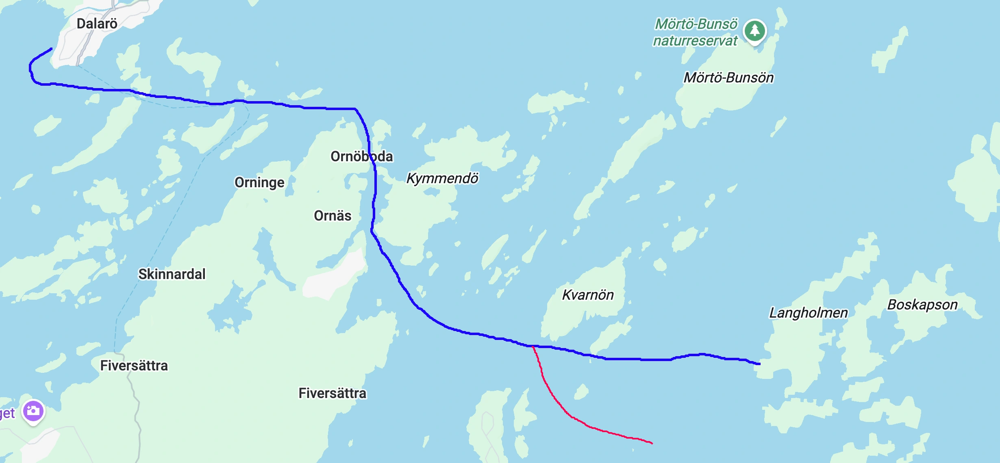

The red line is the route we ended up going.
It was natures decision forced on us.
The wind and waves pushed us to the south, and when I found out it was too late to reroute.
And there were very few islands after Kvarnon.
I used islands to figureI didn't realize this until it was too late.

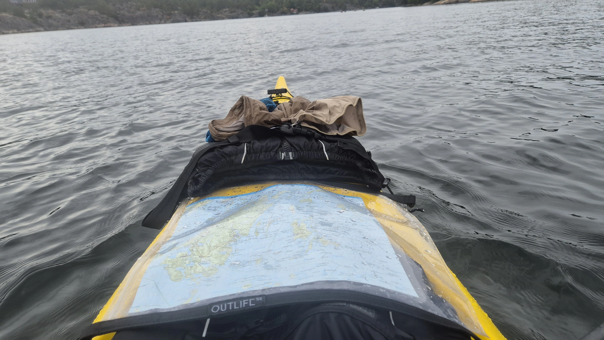

When I realized where we are I knew we could not continue further because it was getting dark.
So we had to stay on a very tiny island that is impossible to see on Google maps.

This was the island. Mostly rocks and stones with a few bushes and no trees.

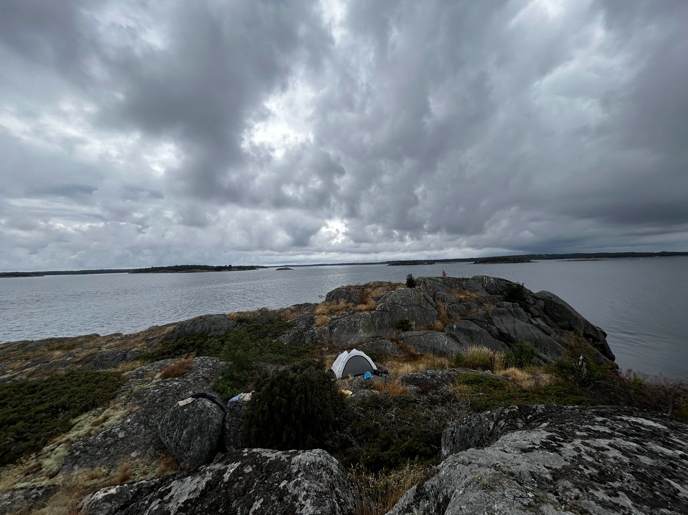

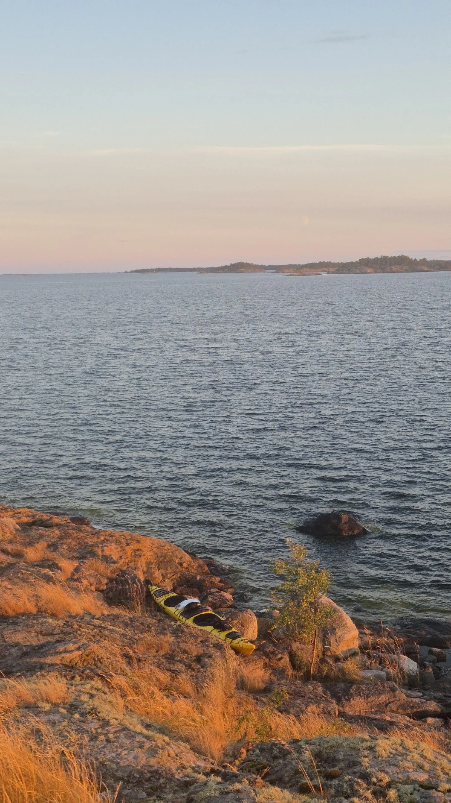

---

On the second day we decided to stay somewhere closer to [Dalarö](https://www.google.com/maps/place/137+70+Dalar%C3%B6,+Sweden/@59.1353285,18.4003147,15z/data=!3m1!4b1!4m6!3m5!1s0x465f7d2156bc730f:0xdf8ade05d0e72528!8m2!3d59.1353294!4d18.4106144!16zL20vMDNfMGww?entry=ttu&g_ep=EgoyMDI2MDgyNS4wIKXMDSoASAFQAw%3D%3D) because we had to be back morning the next day.
And the weather got worse for paddling when it started to rain and got windy.
The opener the sea is the waves are bigger and wind is stronger; hence harder to paddle.
Getting back from the island to Kvarnon was hard.
I was constantly paddling. I couldn't stop. Resting meant the wind pushes the kayak back and remove all the progress.
Seriously, how did people in the older times sailed like this and then went on to conquer another land?

As we got closer to the big island the waves got quieter.
We still had 3 4 hours to [Dalarö](https://www.google.com/maps/place/137+70+Dalar%C3%B6,+Sweden/@59.1353285,18.4003147,15z/data=!3m1!4b1!4m6!3m5!1s0x465f7d2156bc730f:0xdf8ade05d0e72528!8m2!3d59.1353294!4d18.4106144!16zL20vMDNfMGww?entry=ttu&g_ep=EgoyMDI2MDgyNS4wIKXMDSoASAFQAw%3D%3D).
We met two other people on the kayak.
One of them, a Swedish man, could talk in Dutch and Yasaman talked with him.
First time using her Dutch speaking skills outside of the Netherlands!

In the middle of the way it started raining heavily. It was fine but annoying, and we were tired and hungry.
This was enough reason to stop somewhere.
Luckily, we were close to a small island, it was sandy and had big trees on it.
Good rain protection.

There was a firepit in the middle of the trees.
With a big trunk laying on the ground as a chair.
I lit up a candle to start the fire.
Candles are always useful for this. You can carry them everywhere and it burns for a long time, and by placing wood on top of it fire starts.
We had some pasta and a cup of tea then head back to the sea.

There was an island about 40 minutes of the rental place that was a good one to spend the night on so we can get back in time the next day.

This island was also sandy. It's easier to land the kayak on sandy islands since you don't need to pull it up; it slides.

There was a lot of wood so I made a big fire. We dried our clothes and set up the tent.
The sunset was beautiful.

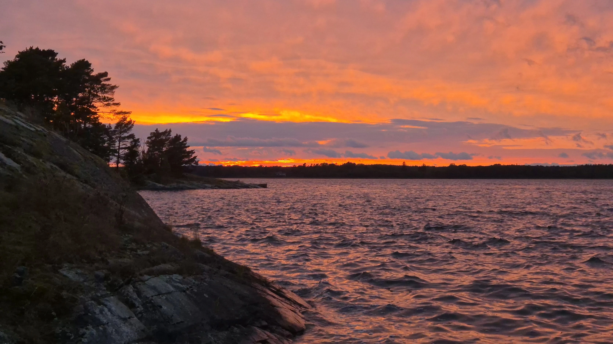

I couldn't sleep on that night.
It was windy and a lot of noises and leafs and branches fall on the ground or on the tent.
Whenever I was close to sleep I dreamed of some animal or a burglar taking our kayak or rain filling our kayak with water.

Next morning we got back.
We cleaned the kayak ourself. It's such a time consuming thing to take out all the dirt out of it. It took about 30 minutes.
We wanted to get some lunch and found [Dalarö Bageri](https://www.google.com/maps/place/Dalar%C3%B6+Bageri/@59.1353285,18.4003147,15z/data=!4m15!1m8!3m7!1s0x465f7d2156bc730f:0xdf8ade05d0e72528!2s137+70+Dalar%C3%B6,+Sweden!3b1!8m2!3d59.1353294!4d18.4106144!16zL20vMDNfMGww!3m5!1s0x46f58660619c13d7:0xa473340ff8dcd8f3!8m2!3d59.1317781!4d18.4067561!16s%2Fg%2F11c46dhpln?entry=ttu&g_ep=EgoyMDI2MDgyNS4wIKXMDSoASAFQAw%3D%3D).
I think it was the only place open in the whole town.
On our way we saw a deer. It was sitting in the backyard of a house.

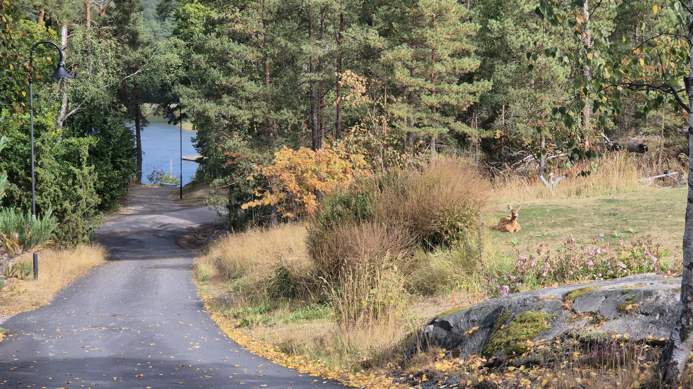

We got pastries, food and coffee it was all delicious.
Although they sold coffee but there was free filter coffee refills so I stayed there for hours and we played [Lost Cities](https://en.wikipedia.org/wiki/Lost_Cities).

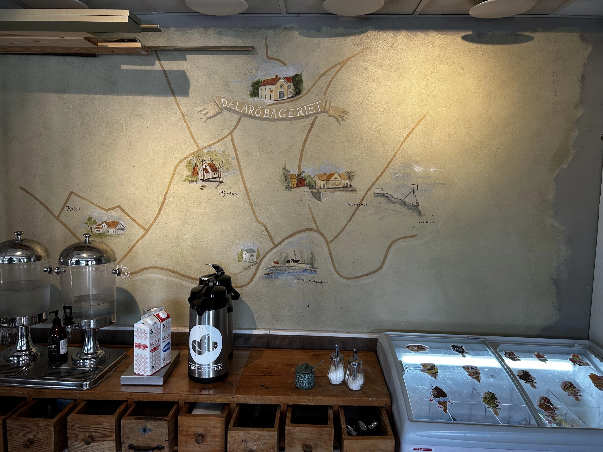

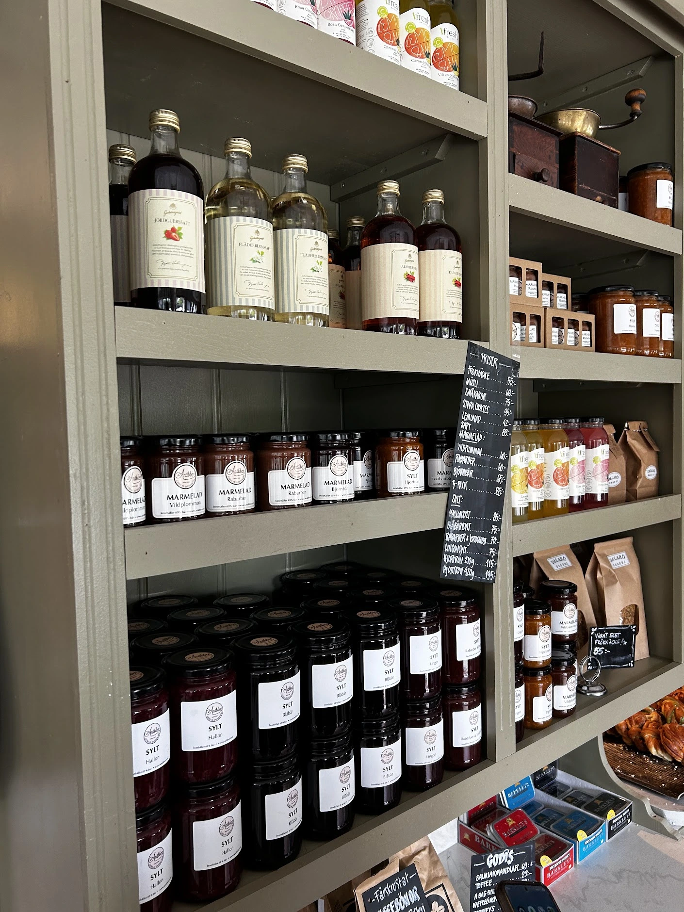

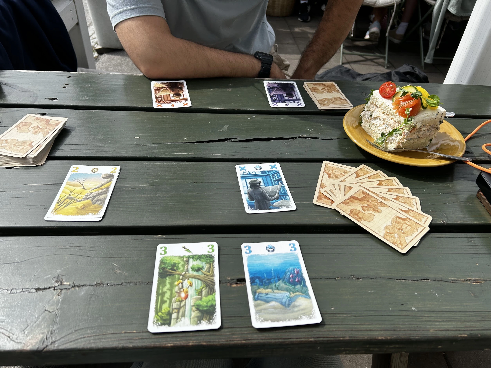

The next destination was [Hotel Winn](https://www.google.com/maps/place/Quality+Hotel+Winn,+Haninge/@59.1298296,17.6869002,9z/data=!3m1!5s0x465f7b7c60ad0a7b:0x11be274cdac2859e!4m13!1m3!11m2!2sjPZifx44A-bs5CXxu5Ku0wQiJparFg!3e3!3m8!1s0x465f7b7c428962b1:0x50507767723e8a4!5m2!4m1!1i2!8m2!3d59.1657033!4d18.1350552!16s%2Fg%2F113f_g75r?entry=ttu&g_ep=EgoyMDI2MDkyMi4wIKXMDSoASAFQAw%3D%3D).
I could really use a shower and hot sauna after being on the water for two days.
In reviews people also said good things about the breakfast and it was great.

It's always facilitating how much more enjoyable things are after going through some uncomfortable situations.
Almost feels like a hack to enjoy things more.

For remainder of the day we went to a park near the hotel.
I love huge parks in cities. It was 5 minute walk. And you suddenly you feel your in the nature, you hear birds and see tall trees.
Also the park was better than those I see in the Netherlands. It had gym equipment!

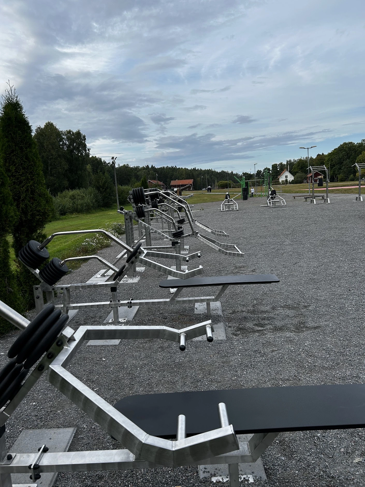

Next day we took the bus to [Tyresta National Park](https://www.google.com/maps/place/Tyresta+National+Park+and+Nature+Reserve/@59.1298296,17.6869002,9z/data=!4m10!1m3!11m2!2sjPZifx44A-bs5CXxu5Ku0wQiJparFg!3e3!3m5!1s0x465f7dfb0b2221f5:0xc6be6d73b12ccc43!8m2!3d59.1843103!4d18.2811826!16zL20vMDlreDgw?entry=ttu&g_ep=EgoyMDI2MDkyMi4wIKXMDSoASAFQAw%3D%3D).
There was a big map at the entrance of the park. And in the map there was an area marked with "Burned part of the forest in 1999".
I was curious what it would look like 20 years later.
So that's the path we walked.

My expectations were low, my imagination was a forest burned to the ground and maybe piles of burned wood everywhere.
But it was not like that.
Actually it would have been considered a normal green forest in Iran.
This part of the forest and much shorter trees. That's not a surprise. It takes time for trees to grow big.

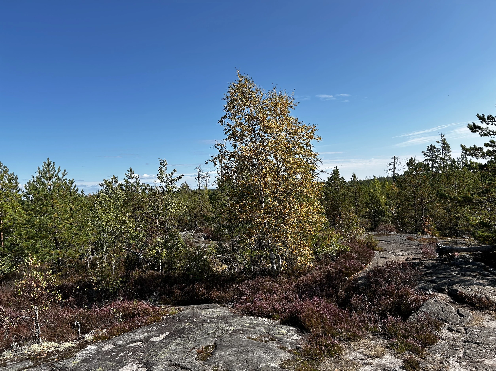

Around the lunch time we arrived somewhere with a big grill.
Before going there I checked and knew there are barbecue places in the forest so I brought some meat to grill.
It was so easy and fun to grill stuff. They even supplied wood to make fire.

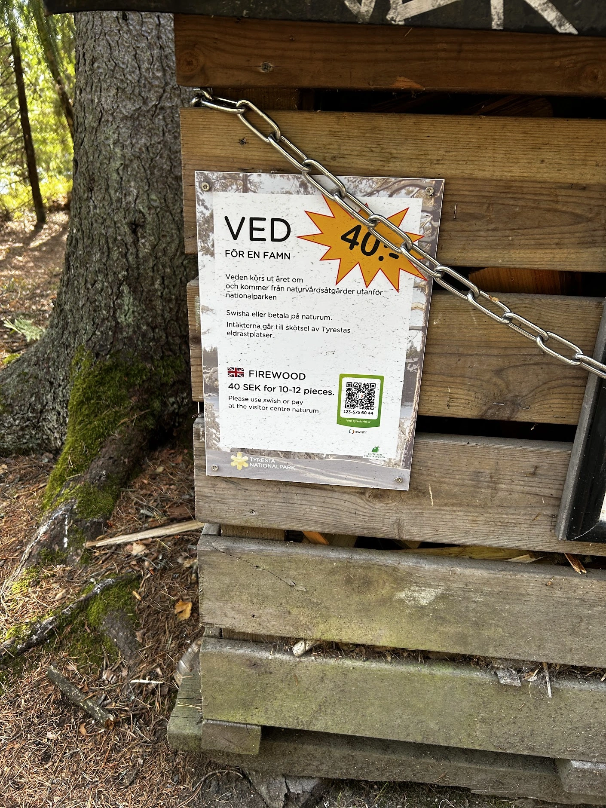
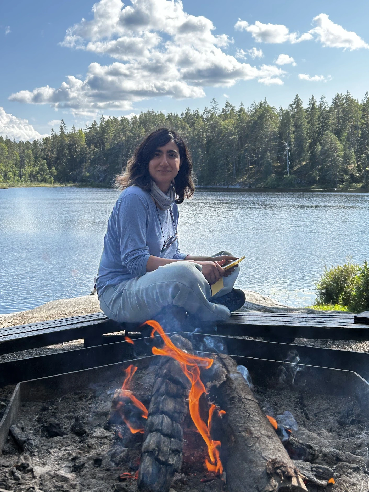

---

After national park we head back to Haninge and we went to the next city, Skogås.

I don't have a lot to say about this city.
There was a nature reserve near it that we thought we might visit but we didn't because we had already walked a lot.
Also the city was just houses and there was no shop or anything except for near the train station. We just stayed there for one night.

Next day we went to Stockholm.
We got off at the southern island, Södermalm.
We walked to the central station from this place and saw the city.

We spent some time at this amazing self service bakery, [Lisas Grabb Café & Hembageri](https://www.google.com/maps/place/Lisas+Grabb+Caf%C3%A9+%26+Hembageri/@59.3104262,18.0742113,57m/data=!3m1!1e3!4m6!3m5!1s0x465f770e74c94dd3:0x6de052828807fb2c!8m2!3d59.3103381!4d18.0742443!16s%2Fg%2F11h3yh_2q6?entry=ttu&g_ep=EgoyMDI2MDkyMy4wIKXMDSoASAFQAw%3D%3D), and played some card games.

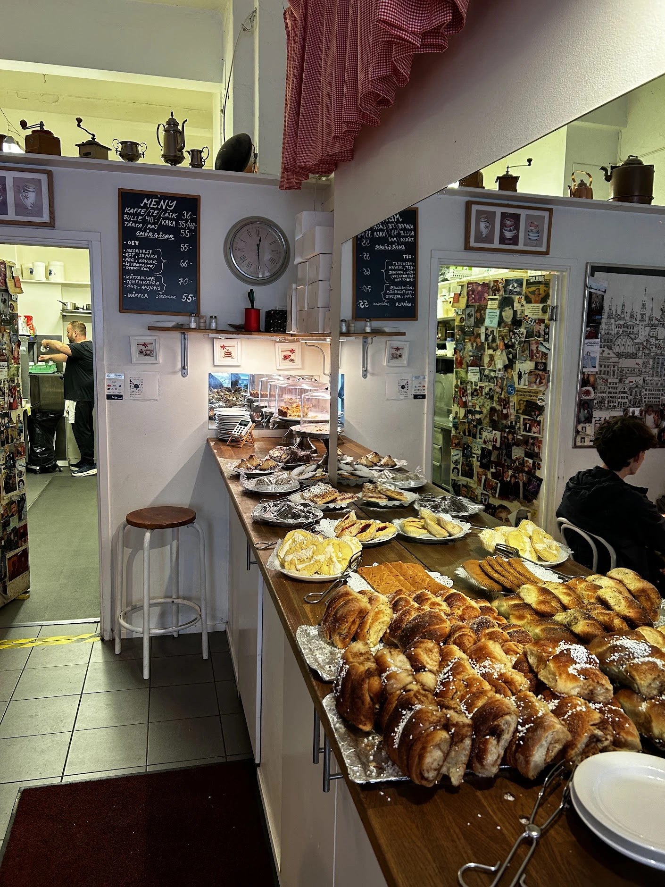
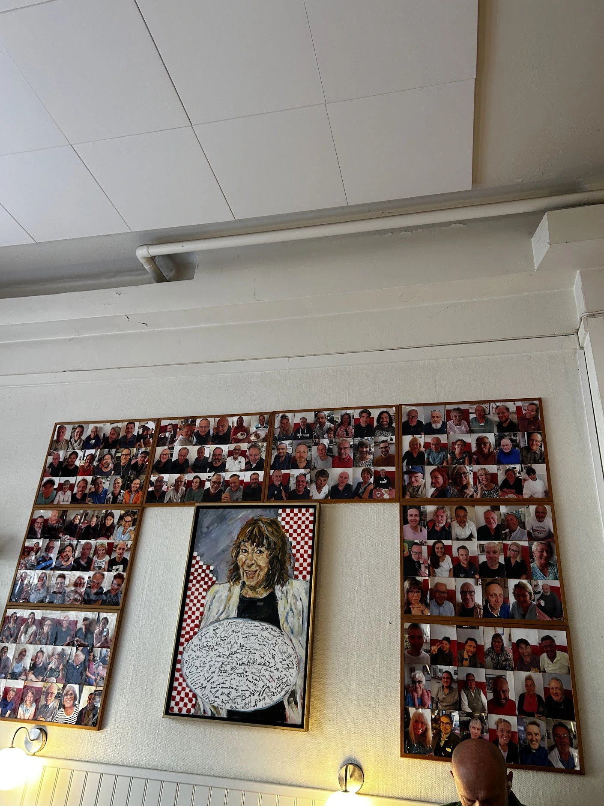

In Stockholm we saw the royal palace but didn't walk inside. There was a line and we preferred to see rest of the city.

We had great lunch at [DiWINE Stockholm](https://www.google.com/maps/place/DiWINE+Stockholm/@59.3303468,18.0639869,19z/data=!4m6!3m5!1s0x465f9ddd88376ef3:0x1180c1f3ea4732c2!8m2!3d59.3303468!4d18.0647629!16s%2Fg%2F11gy745jf_?entry=ttu&g_ep=EgoyMDI2MDkyMi4wIKXMDSoASAFQAw%3D%3D).

---

Useful links:

- [Arlanda Express](https://www.arlandaexpress.com/tickets) for getting to Stockholm from the airport.
- [SL](https://sl.se/en/in-english/fares--tickets/) is for train and bus. The metro here is deep as hell be prepared to go down 100 stairs.
