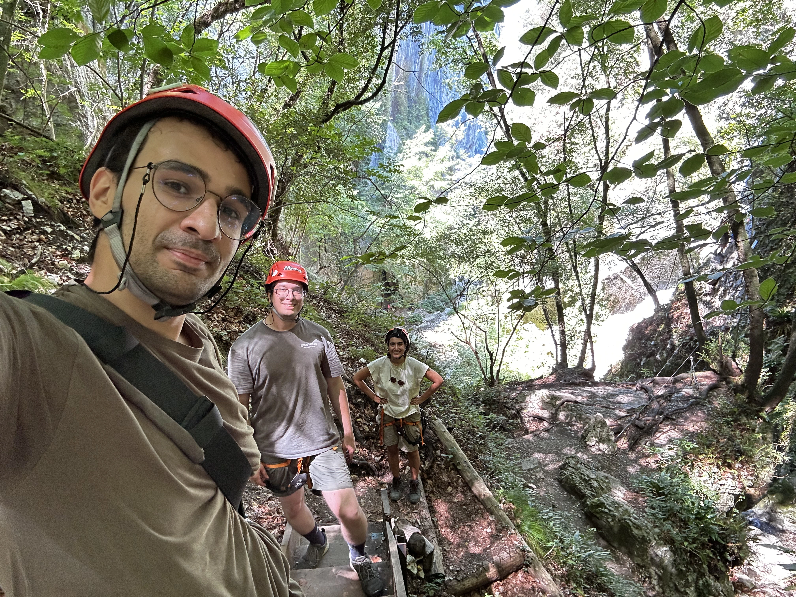
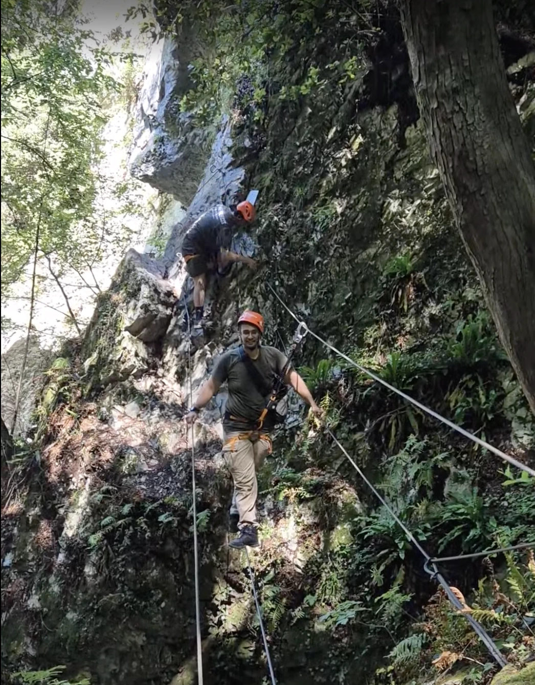

When planning this trip I thought we are going to stay in Milan or close to it.
But my friend Alireza chose a place 2 hour away from Milan to be closer to nature.
It was a great decision!

---

We stayed at [Cazzano di Brentonico](https://www.google.com/maps/place/38060+Cazzano,+Autonomous+Province+of+Trento,+Italy/@45.8175064,10.9658636,17z/data=!3m1!4b1!4m15!1m8!3m7!1s0x47820576a09308c9:0xa7dfcfb14e10b919!2s38060+Crosano,+Autonomous+Province+of+Trento,+Italy!3b1!8m2!3d45.819468!4d10.9700031!16s%2Fg%2F11b6gg3rjq!3m5!1s0x47820573852af967:0x260709882e6f2451!8m2!3d45.8169285!4d10.9690291!16s%2Fg%2F11b6gh2wxc?entry=ttu&g_ep=EgoyMDI2MDcxNS4wIKXMDSoASAFQAw%3D%3D). It's close to the big lake there. Small quite city. A lot of fruit trees with their fruits on them.
Neighbor cities are quite close. You can just walk along the road and reach the next one. We did it to grab some fresh pastries.

Dolomites mountain range was about two hours from our place by car. We also went there.
Beautiful landscape. It is pretty crowded specially in summer.
There seemed to be a small village on the mountain Seceda but we didn't go. It was quite far from us.
There's nothing special since most of the way is with cable cars. But it's pretty to take pictures.

I also learned about ferreta there. It's paths on a mountain that have hooks and a cable going through them.
You can climb the mountain using the cables and attach yourself to it so if you fall you don't die.
We were excited to try it. I found [a place](https://www.mmove.it/) that provided gears.
Then we were looking for a path to try.
Since we were all beginners I looked for a path that is doable on the first try.

I found a bunch of paths[^1] that fitted our experience. Ultimately we decided to try [Rio Sallagoni](https://www.ferrate365.it/en/vie-ferrate/ferrata-rio-sallagoni-castel-drena/) since you had to walk over a rope for part of the path.
Doing a ferreta was one of the best experiences of my life. I am so happy I did it and will do it again.
It's a good balance between hiking and climbing.
You are not in danger of death, and at the same time get to see cliffs and edges.
Maybe with higher levels it gets dangerous.
You also get good elevation and it's nice to do it near a scenic route.

---

For restaurants, We went to [Lo Scoglio](https://maps.app.goo.gl/KzHmoyKURZGkFWMJ9) several times. 
We also went to [Maso Palù](https://maps.app.goo.gl/uH8W6fjhxCEwNDdx7) and had a delicious fancy meal.

---
[^1]:
	https://www.ferrate365.it/en/vie-ferrate/ferrata-susatti-cima-capi/
	https://www.ferrate365.it/en/vie-ferrate/ferrata-somator-biaena/
	https://www.ferrate365.it/en/vie-ferrate/sentiero-attrezzato-cavre-scaloni-anglone/
	https://www.ferrate365.it/en/vie-ferrate/ferrata-colodri-arco/
	https://www.ferrate365.it/vie-ferrate/ferrata-campione-del-garda/